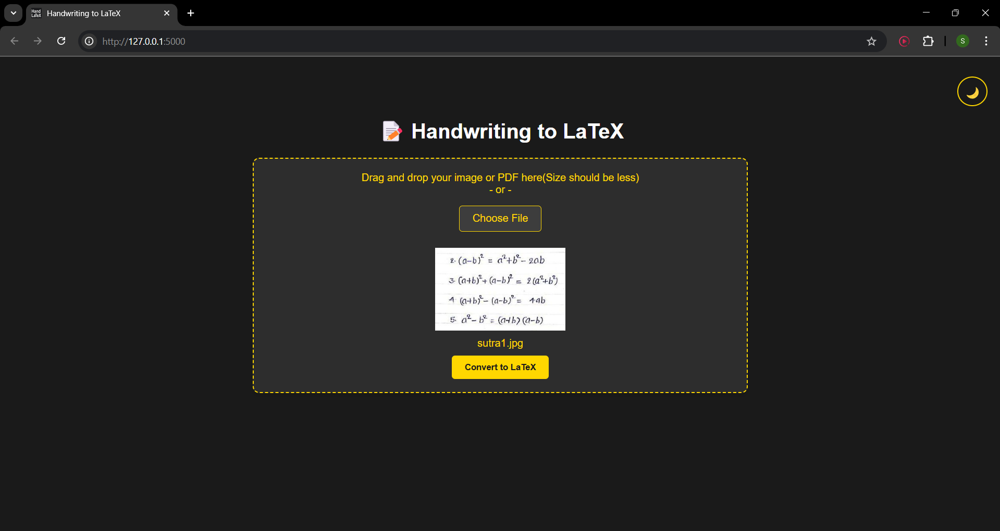
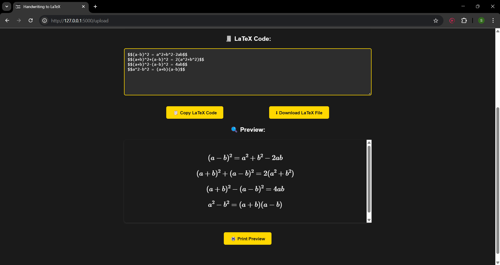
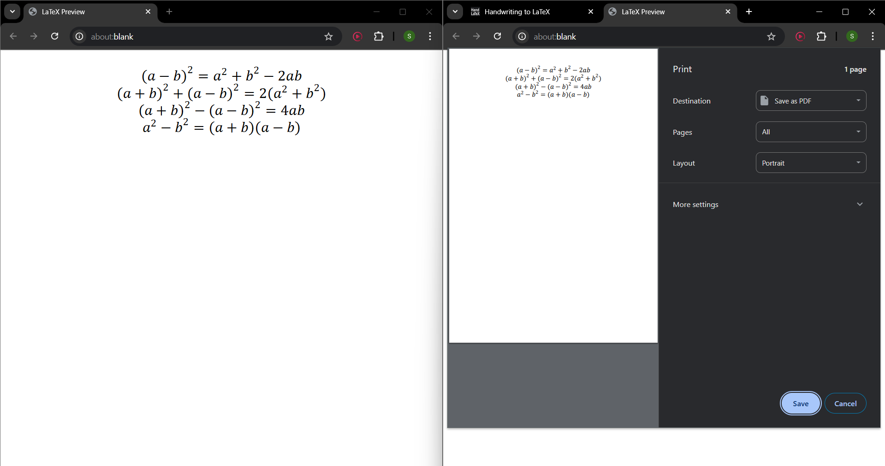
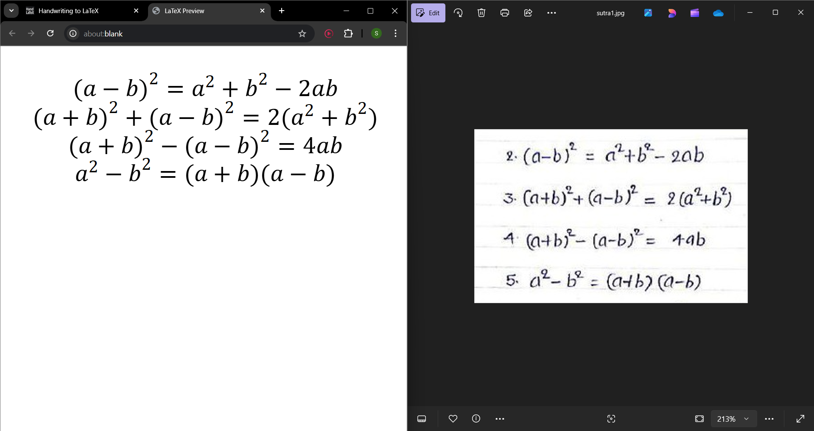
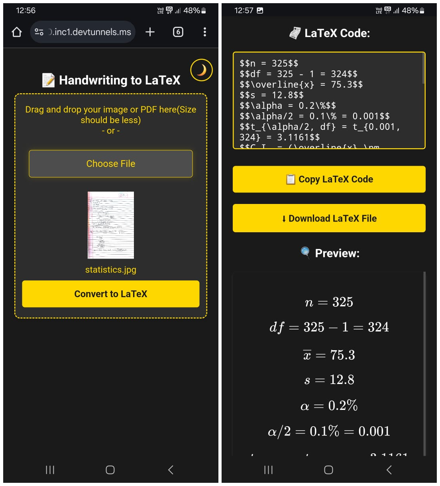
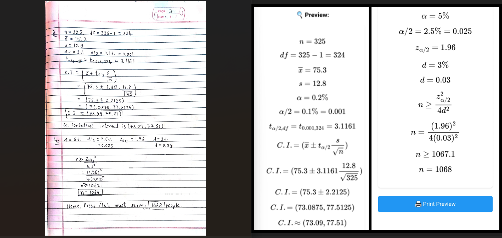
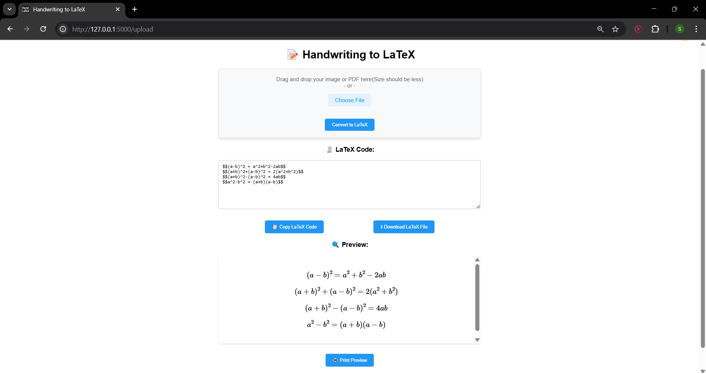

🖋️ Handwriting to LaTeX Converter
==================================

Convert handwritten mathematical expressions into LaTeX code using AI!

🚀 Overview
-----------

This project allows users to upload images or PDFs containing handwritten mathematical equations. An AI model directly interprets the visuals and converts them into accurate LaTeX code.

✨ Features
----------

*   📸 **Image Input**: Upload handwritten math images (JPG, PNG, etc.)
    
*   📄 **PDF Support**: Upload multi-page PDFs, each page will be processed.
    
*   🧠 **AI-Powered**: Uses AI to understand handwriting.
    
*   🧾 **LaTeX Output**: Returns clean, editable LaTeX code.

*  📋 **Copy-to-clipboard** : Instantly copy your LaTeX output to the clipboard. ✨
    

🛠️ Tech Stack
--------------

*   **Backend**: Flask Python
    
*   **AI Model**: Gemini API 
    
*   **PDF Handling**: pdf2image
    
*   **Frontend**: HTML/CSS/JS
    

📂 How It Works
---------------

1.  Upload a handwritten math image or PDF.
    
2.  Each page/image is sent to the AI model.
    
3.  The model returns LaTeX code for the detected formulas.
    
4.  Output is displayed or downloaded for use in documents.
    

📦 Installation
---------------

To get started with the **Handwritten Formula to LaTeX Converter**, follow these steps:

1. **Clone the Repository**
    ```bash
    git clone https://github.com/utsav2110/Handwritten-Formula-to-LaTeX-Converter.git
    ```

2. **Navigate to the Project Directory**
    ```bash
    cd Handwritten-Formula-to-LaTeX-Converter
    ```

3. **Install Dependencies**
    ```bash
    pip install -r requirements.txt
    ```

▶️ Run the App
--------------

To start the application, run the following command in your terminal:

```bash
python app.py
```

Visit `http://127.0.0.1:5000/` in your browser.

📸 Sample Inputs And Outputs
----------------

### Upload Image Or PDF

    
### Click on Convert to LaTeX


### Print Preview and Print


### Text Comparison


### Responsive And Clear Output On Mobile Phone


### Verify Conversion (100% Correct Output)


### Light Theme


# Project Live Link

<h3> Check out website Live Link </h3>

<h5><a href="https://handwritten-formula-to-latex-converter.onrender.com/" style="font-size: 20px;">Click Here</a></h5>

<h3> Or </h3>

`https://handwritten-formula-to-latex-converter.onrender.com/`